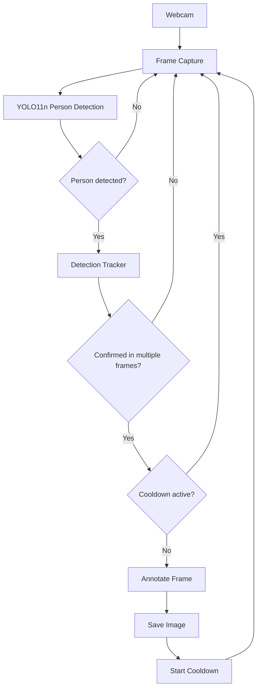

# Person Detection Monitor

A local, real-time webcam monitoring application that uses YOLO11n to detect
people, confirms the detection across multiple frames to avoid false
positives, and saves an annotated snapshot of the moment the presence was
confirmed.

## 1. Project overview

This application watches a webcam feed locally, runs person detection with
YOLO11n on Apple Silicon (via MPS, with automatic CPU fallback), and, once a
person's presence is confirmed across several consecutive frames, saves a
timestamped, annotated JPEG into the `detections/` folder. It runs entirely
on-device: there is no networking, no external API, no WhatsApp integration,
and no cloud storage involved in this version.

## 2. Application purpose

The goal is to provide a lightweight, private "is someone in front of my
camera" detector for a single machine — useful as a building block for a
future notification system, without taking on any of that complexity yet.

## 3. Architecture

The application is split into small, single-responsibility modules under
`app/`:

| Module | Responsibility |
| --- | --- |
| `config.py` | Loads, converts and validates all configuration from environment variables. |
| `logging_config.py` | Configures the standard `logging` module with a consistent format. |
| `camera.py` | Encapsulates `cv2.VideoCapture` (open, read frame, release). |
| `detector.py` | Loads YOLO11n once, runs inference, filters for `person`, handles MPS→CPU fallback. |
| `models.py` | Frozen dataclasses (`Detection`, `DetectionCapture`) shared across modules. |
| `detection_tracker.py` | Sliding-window confirmation logic. Pure Python, no CV/YOLO dependency. |
| `capture_controller.py` | Cooldown state machine with an injectable clock. |
| `image_manager.py` | Annotates frames, saves JPEGs with unique names, prunes expired images. |
| `alert_recorder.py` | Best-effort MySQL alert history + WhatsApp delivery (see section 21) — never blocks the monitor if the database or Z-API is unreachable. |
| `main.py` | Composition root: wires the components together and runs the capture loop. |

`run.py` at the project root is the executable entry point.

Each component is designed to be independently testable: `detection_tracker.py`
and `capture_controller.py` have no dependency on OpenCV, NumPy or YOLO, and
`image_manager.py` only depends on plain `Detection` values, not on the model.

## 4. Application flow



## 5. Requirements

* macOS (developed and tested for Apple Silicon)
* Python 3.11 or later
* A working webcam
* ~500 MB free disk space for dependencies and the YOLO11n weights

## 6. Installation on macOS

```bash
git clone <this-repository>
cd HasSomeoneInMyHosue
```

## 7. Virtual environment setup

```bash
python3 -m venv .venv
source .venv/bin/activate
```

## 8. Dependency installation

```bash
pip install -r requirements.txt
```

The first run will download the `yolo11n.pt` weights automatically via
Ultralytics if the file referenced by `MODEL_PATH` is not already present.

## 9. Environment configuration

```bash
cp .env.example .env
```

Then adjust `.env` as needed. All available variables are documented below.

| Variable | Default | Description |
| --- | --- | --- |
| `CAMERA_INDEX` | `0` | OpenCV camera index. |
| `CAMERA_WIDTH` | `1280` | Requested capture width. |
| `CAMERA_HEIGHT` | `720` | Requested capture height. |
| `MODEL_PATH` | `yolo11n.pt` | Path or name of the YOLO11n weights. |
| `MODEL_IMAGE_SIZE` | `480` | Inference image size. |
| `CONFIDENCE_THRESHOLD` | `0.65` | Minimum confidence to accept a person detection. |
| `PROCESS_EVERY_N_FRAMES` | `2` | Run inference on 1 out of every N captured frames. |
| `DETECTION_WINDOW_SIZE` | `5` | Number of recent processed frames tracked. |
| `MINIMUM_POSITIVE_FRAMES` | `3` | Minimum positive frames within the window to confirm presence. |
| `CAPTURE_DELAY_SECONDS` | `0.5` | Delay, in seconds, between a confirmed detection and the actual capture. |
| `CAPTURE_COOLDOWN_SECONDS` | `0` | Minimum time between two saved images. `0` means every new confirmed detection is saved. |
| `IMAGE_DIRECTORY` | `detections` | Folder where annotated images are saved. |
| `IMAGE_FORMAT` | `jpg` | Image file extension. |
| `IMAGE_JPEG_QUALITY` | `90` | JPEG quality (1–100). |
| `IMAGE_RETENTION_HOURS` | `24` | Age after which saved images are deleted. |
| `IMAGE_CLEANUP_INTERVAL_MINUTES` | `30` | How often the retention cleanup runs while the app is active. |
| `LOG_LEVEL` | `INFO` | Standard `logging` level name. |

## 10. Running the application

```bash
python run.py
```

Press `q` with the video window focused to quit. The webcam and windows are
released in all shutdown paths (`q`, `Ctrl+C`, unexpected errors, camera
failures).

## 11. Running the tests

```bash
pytest
```

The test suite covers `config`, `detection_tracker`, `capture_controller` and
`image_manager`. None of the tests open a webcam, download the YOLO model,
run real inference, or touch the real `detections/` folder — they use
temporary directories, synthetic frames and fake clocks instead.

## 12. How person detection works

Each processed frame is passed to a YOLO11n model loaded once at startup.
Inference is restricted to COCO class `0` (`person`) and results below
`CONFIDENCE_THRESHOLD` are discarded. To keep the app light on an 8 GB
MacBook Air, only 1 out of every `PROCESS_EVERY_N_FRAMES` captured frames is
actually run through the model; the rest are only used for the live preview
and the FPS counter.

## 13. Why multiple-frame confirmation is used

A single positive frame can be a false positive (motion blur, lighting,
reflections, a person just passing through the frame edge). The
`DetectionTracker` keeps a sliding window of the last `DETECTION_WINDOW_SIZE`
processed frames and only confirms presence once at least
`MINIMUM_POSITIVE_FRAMES` of them contained a person. This trades a small
amount of latency for a meaningful reduction in spurious captures.

## 14. How the cooldown works

A capture is not taken the instant a detection is confirmed. The
`CaptureController` waits `CAPTURE_DELAY_SECONDS` (default `0.5`) after the
confirmation before actually saving the frame, so the saved image reflects
the scene a moment after the person was first confirmed rather than the
exact confirmation instant.

Once that delay elapses and the image is successfully saved, the
`CaptureController` starts a cooldown of `CAPTURE_COOLDOWN_SECONDS`. No new
image is saved while the cooldown is active, even though the webcam keeps
capturing and the detector keeps running. By default `CAPTURE_COOLDOWN_SECONDS`
is `0`, so the cooldown is effectively disabled and a new image is saved for
every new confirmed detection (the detection tracker's own reconfirmation
window is what naturally spaces out repeated saves while the same person
stays in frame). Set `CAPTURE_COOLDOWN_SECONDS` to a positive value if you
want to throttle saves further.

The cooldown only starts *after* a successful save — if writing the file
fails, the cooldown is not started, the error is logged, and the application
keeps monitoring normally.

## 15. How images are generated and stored

When a detection is confirmed and the cooldown allows it:

1. The current frame is copied (the original frame used for display is left
   untouched).
2. A bounding box and confidence score are drawn for every detected person.
3. The current date/time and the text `Person detected` are added.
4. The image is encoded as JPEG (`IMAGE_JPEG_QUALITY`) and written to
   `IMAGE_DIRECTORY` with a unique name that includes microsecond precision,
   e.g. `detections/detection_20260716_153000_123456.jpg`.

The save function returns the full path of the file it created, or `None` if
saving failed — a failure is logged but never crashes the application.

## 16. How image retention works

On startup, and then every `IMAGE_CLEANUP_INTERVAL_MINUTES` while running,
the application scans `IMAGE_DIRECTORY` for files matching `IMAGE_FORMAT`
and removes those older than `IMAGE_RETENTION_HOURS`. Subdirectories and
unrelated files are left untouched, and a failure removing one file does not
stop the cleanup of the others.

## 17. Performance considerations for a MacBook Air M3 with 8 GB

* YOLO11n is the smallest model in the YOLO11 family, keeping memory and
  compute usage low.
* Inference runs at `480px` and only on every other captured frame.
* Detection is restricted to a single class (`person`), reducing
  post-processing work.
* The model is loaded exactly once at startup, not per frame.
* MPS is used automatically when available, with a safe fallback to CPU if
  an operation is unsupported.
* Frame copies are only made when a copy is actually required (annotation,
  saving); the app does not accumulate frames in memory.
* The main loop avoids per-frame logging; only meaningful state transitions
  are logged.

## 18. Privacy considerations

* Only use this application in spaces where you have the legal right and
  consent from anyone who may be recorded to run video monitoring.
* Treat the `detections/` folder as sensitive: do not expose it publicly
  (e.g. via a shared folder, web server, or cloud sync) and do not commit
  captured images to version control (`.gitignore` already excludes them).
* The optional web dashboard (see section 21) binds to `127.0.0.1` only by
  default. Do not change it to bind to `0.0.0.0` or expose it on your
  network unless you add authentication in front of it — anyone who can
  reach it can view and delete detection images.
* Image retention is time-limited by design — set `IMAGE_RETENTION_HOURS` to
  the shortest period that still meets your needs.
* This application does not perform facial recognition or identify who was
  detected — it only detects that a person is present.
* Review and comply with local laws regarding video recording and
  monitoring, including any notice/consent requirements for the location
  where the camera is installed.

## 19. Known limitations

* Detection can produce false positives (e.g. photos, posters, or reflections
  containing people) and false negatives (e.g. partial occlusion, poor
  lighting, unusual poses).
* This is not a certified security system and should not be used as the sole
  mechanism for safety-critical monitoring.
* Only person detection is implemented — there is no tracking of a specific
  individual across sessions, and no facial recognition.
* The application depends on a single local webcam and does not support
  multiple simultaneous camera feeds.

## 20. Future improvements

* Optional multi-camera support.
* Configurable detection zones within the frame.
* Pluggable notification backends (explicitly out of scope for this version).
* Password reset / email verification for dashboard accounts.

## 21. Web dashboard (optional)

A small, read-only local web dashboard lets you browse saved detections from
a browser instead of the filesystem. It lives entirely under `web/` and is a
separate process from the monitor — it never opens the webcam, never runs
inference, and cannot start or stop the monitor. It only lists, serves and
(if you choose to) deletes the JPEG files the monitor already saved to
`IMAGE_DIRECTORY`.

**Stack:** FastAPI (backend API), static HTML/JS frontend styled with
Tailwind CSS (via CDN, no build step), MySQL user store (via SQLAlchemy +
PyMySQL) and JWT bearer tokens for authentication.

**Structure:** `web/server.py` only builds the FastAPI app (middleware,
lifespan, mounting the static frontend) and includes the routers under
`web/routers/` — one module per area (`auth_router`, `detections_router`,
`alerts_router`, `monitor_router`, `webcam_router`), each just wiring HTTP
(or WebSocket) endpoints to the service modules (`auth_service.py`,
`alert_service.py`, `gallery.py`, `monitor_process.py`,
`webcam_session.py`) that hold the actual logic.

### Authentication

Every dashboard API route except `/api/auth/register` and `/api/auth/login`
requires a logged-in user. Passwords are hashed with PBKDF2-HMAC-SHA256,
600,000 iterations (OWASP's current minimum), a random salt per user,
standard-library only — no compiled dependency; sessions are stateless JWTs
signed with `JWT_SECRET_KEY`.

Registration also collects a `phone_number` — digits only, country code +
area code + number, no `+`/spaces/dashes (e.g. `5524981402661`). It is
stored on the user record for a future WhatsApp delivery feature (not
implemented yet); it plays no role in login itself. Existing users created
before this field existed keep `phone_number: null` until they re-register
or a future "update profile" endpoint is added — there is no automatic
backfill.

Additional hardening in this layer:

* **Constant-time login** — `authenticate_user` always runs a password hash
  comparison, even for an email that does not exist, so response timing
  cannot be used to enumerate registered accounts.
* **Rate limiting** — `/api/auth/login` and `/api/auth/register` each allow
  5 attempts per minute per client IP (in-memory, single-process; not meant
  to survive restarts or a multi-process deployment), returning `429` past
  that.
* **Closeable registration** — `ALLOW_PUBLIC_REGISTRATION` (see below) lets
  you shut off self-service signup once you've created your account(s).
* **Basic security headers** on every response: `X-Content-Type-Options:
  nosniff`, `X-Frame-Options: DENY`, `Referrer-Policy: no-referrer`.
* Registration is protected against a race where two concurrent requests
  for the same email both pass the pre-check — the database's `UNIQUE`
  constraint is the real guard, and a conflict there is still reported as a
  clean `409`, not a `500`.

Configure the MySQL connection and JWT settings in `.env`:

```env
DB_HOST=127.0.0.1
DB_PORT=3306
DB_USER=app_user
DB_PASSWORD=app_password
DB_NAME=app_database

JWT_SECRET_KEY=insecure-dev-secret-change-me
JWT_EXPIRES_MINUTES=120

ALLOW_PUBLIC_REGISTRATION=true
```

**Change `JWT_SECRET_KEY`** to a long random value before using this beyond
your own machine — the dashboard logs a warning on startup if it detects the
insecure default. On startup, the dashboard automatically creates the
`DB_NAME` database (if it does not exist yet) and the `users` table; no
manual migration step is needed. Registration is open to anyone who can
reach the dashboard by default (there is no invite/admin gate) — set
`ALLOW_PUBLIC_REGISTRATION=false` once you've created your account(s) to
close it, especially if you ever bind the server beyond `127.0.0.1` — see
section 18.

Run it (with the same virtual environment and `.env` used by `run.py`, and
MySQL reachable at the configured host/port):

```bash
python run_web.py
```

Then open `http://127.0.0.1:8000`, create an account at `/register.html`,
and log in at `/login.html`. It exposes:

| Endpoint | Description |
| --- | --- |
| `POST /api/auth/register` | Creates a user from `{email, password, phone_number}` (password min. 8 characters; phone_number 10–15 digits, no `+`/spaces/dashes). |
| `POST /api/auth/login` | Returns a JWT `access_token` for valid credentials. |
| `GET /api/auth/me` | Returns the currently authenticated user. |
| `GET /api/status` | Detection count, latest detection time, and the active configuration. |
| `GET /api/detections` | Paginated list of saved detections (`limit`, `offset`). |
| `GET /api/detections/{filename}/image` | The raw JPEG for a given detection. |
| `DELETE /api/detections/{filename}` | Deletes a saved detection image. |
| `GET /api/alerts` | Paginated alert history (`limit`, `offset`), most recent first. |
| `GET /api/monitor/status` | Whether the monitor is currently running, and its PID. |
| `POST /api/monitor/start` | Starts `run.py` as a child process. |
| `POST /api/monitor/stop` | Stops the running monitor process. |

All routes other than the two auth routes above require an
`Authorization: Bearer <token>` header; the frontend stores the token in
`localStorage` after login and attaches it automatically. It polls the
authenticated endpoints every 5 seconds, so new images saved by the
monitor, and the monitor's own running/stopped state, stay up to date
without a page reload. A `Sair` (logout) button clears the stored token.

The dashboard also has a **"Monitorar" / "Encerrar"** button that starts and
stops `run.py` for you, so you do not have to keep a separate terminal open:

* **Monitorar** (green) launches `run.py` as a child process of the
  dashboard, using the same Python interpreter the dashboard itself is
  running under (so it must be the one from your `.venv`).
* Once running, the button turns **Encerrar** (red). Clicking it sends
  `SIGINT` to the monitor process — the same signal `Ctrl+C` sends — which
  `app/main.py` already handles to release the camera and close windows
  cleanly before exiting.
* If the monitor stops on its own (e.g. you pressed `q` in its window, or it
  hit a camera error), the button automatically reverts to **Monitorar** on
  the next poll.
* The dashboard only tracks monitor processes it started itself. If you also
  run `python run.py` manually in a separate terminal, the two will compete
  for the same webcam.

### Alert history

Every time the monitor saves a detection image, it also writes a row to an
`alerts` table in the same MySQL database (`message`, `image_path`, `sent`,
`created_at`), then immediately tries to deliver that same message via
WhatsApp (see below). This is a durable history the owner can fall back on
if a WhatsApp message fails to send or gets lost/deleted on their phone —
`sent` reflects whether delivery actually succeeded, not just that it was
attempted.

This is wired directly into `app/main.py`, not the web dashboard: alert
recording and WhatsApp delivery both work whether or not `run_web.py` is
running, as long as MySQL (and, for delivery, Z-API) are reachable. If the
database is unreachable when the monitor starts, it logs one warning and
disables alert recording for that run — saving detection images and the
rest of the monitor keep working normally either way.

#### WhatsApp delivery (Z-API)

Right after an alert is recorded, the monitor sends it as a WhatsApp image
message via [Z-API](https://www.z-api.io/) (`POST
/instances/{instanceId}/token/{token}/send-image`) to the phone number of
the earliest-registered dashboard user that has one set (this app has no
explicit "owner" flag, so the first account with a phone number is treated
as the recipient). The request body is `{"phone", "image", "caption"}`,
where `caption` is the alert's message and `image` is the detection image
read from disk and inlined as a base64 `data:` URI (via
`web/image_encoder.py`) — Z-API's servers cannot reach a path on the
monitor's local filesystem, so the image bytes travel in the request body
itself rather than as a path or URL. On an HTTP `200` response, the
alert's `sent` flag is set to `true`; on any other status, a network
error, a timeout, or a failure to read the image file, the attempt is
logged and the alert is left `sent: false` — there is no retry queue yet,
but the row is never lost, so a future retry mechanism (or a manual
"Enviar" action) can pick it up later.

Configure the Z-API credentials in `.env`:

```env
ZAPI_INSTANCE_ID=your-zapi-instance-id
ZAPI_TOKEN=your-zapi-token
ZAPI_CLIENT_TOKEN=your-zapi-client-token
```

Leaving any of these unset or blank disables WhatsApp delivery entirely
(logged once at startup) — alert history keeps working normally either
way. A send attempt is bounded to 10 seconds; since this runs synchronously
in the monitor's main loop, a slow or unreachable Z-API delays the next
captured frame by up to that long. There is no per-message retry and no
rate limiting on outgoing messages — a person standing continuously in
frame with `CAPTURE_COOLDOWN_SECONDS=0` will trigger one WhatsApp send per
confirmed detection cycle (roughly every `CAPTURE_DELAY_SECONDS` while they
remain in view).

Browse the history at `/alerts.html` (linked from the dashboard as
**"Histórico de Alertas"**), or via `GET /api/alerts` (`limit`, `offset`;
requires authentication like the rest of the dashboard), ordered from most
recent to oldest. Each entry shows its saved image when the file is still
on disk — if the image was later deleted (manually or by retention
cleanup), the entry still shows its message and timestamp, with an "Imagem
indisponível" placeholder instead of a thumbnail.

### Browser webcam monitoring (for VPS deployments)

`app/main.py` opens the webcam with `cv2.VideoCapture` **on whatever machine
runs `python run.py`** — there is no browser-based camera capture involved
in that path. Deploying the whole stack to a VPS with no physical camera
attached means that process has nothing to open.

For that case, any logged-in user can instead turn **their own browser's
webcam** into a monitoring source, from `/webcam.html` (linked from the
dashboard as **"Usar minha câmera"**). The browser asks for camera
permission (a native prompt the user must accept — this app cannot bypass
it), then streams JPEG frames to the server over a WebSocket
(`/ws/webcam`); the server runs the same `PersonDetector`, saves detection
images with the same `ImageManager`, and records/sends alerts with the same
`AlertRecorder` the physical monitor uses — same `IMAGE_DIRECTORY`, same
`alerts` table, same WhatsApp delivery. Only the sliding-window tracker and
cooldown state are per-browser-session (`web/webcam_session.py`); the model
itself is loaded once and shared (with an `asyncio.Lock` serializing
inference across simultaneous sessions). This app treats all logged-in
accounts as one shared household, exactly like the rest of the dashboard —
there is no per-user data isolation, and any active browser session behaves
like one more physical camera would.

The JWT is sent as the **first WebSocket message** (`{"token": "..."}`),
not as a query parameter, so it does not end up in access/proxy logs. The
local monitor (`run.py` / the "Monitorar" button) is untouched by this and
keeps working exactly as before, for whoever runs this on a machine with an
actual webcam attached.

**Deployment requirement:** `getUserMedia` (the browser camera API) only
works in a secure context — `https://` or `localhost`. On a VPS this means
you need real TLS in front of Uvicorn (e.g. nginx or Caddy with Let's
Encrypt); without it, visitors' browsers will not even show the camera
permission prompt. A VPS also almost certainly has no MPS/GPU, so YOLO11n
inference falls back to CPU (`select_device()` already handles this) and
will be slower than on the Mac M3 this project was built on — the capture
interval in `web/static/js/webcam.js` (`CAPTURE_INTERVAL_MS`, 700ms by
default) can be raised to reduce load if needed.

## Project structure

```text
HasSomeoneInMyHosue/
├── app/
│   ├── __init__.py
│   ├── main.py
│   ├── config.py
│   ├── camera.py
│   ├── detector.py
│   ├── models.py
│   ├── detection_tracker.py
│   ├── capture_controller.py
│   ├── image_manager.py
│   ├── alert_recorder.py
│   └── logging_config.py
├── detections/
│   └── .gitkeep
├── web/
│   ├── __init__.py
│   ├── server.py
│   ├── routers/
│   │   ├── __init__.py
│   │   ├── auth_router.py
│   │   ├── detections_router.py
│   │   ├── alerts_router.py
│   │   ├── monitor_router.py
│   │   └── webcam_router.py
│   ├── dependencies.py
│   ├── webcam_session.py
│   ├── gallery.py
│   ├── monitor_process.py
│   ├── auth_config.py
│   ├── auth_service.py
│   ├── alert_service.py
│   ├── whatsapp_config.py
│   ├── whatsapp_client.py
│   ├── image_encoder.py
│   ├── security.py
│   ├── rate_limiter.py
│   ├── db.py
│   ├── db_models.py
│   ├── schemas.py
│   └── static/
│       ├── index.html
│       ├── login.html
│       ├── register.html
│       ├── alerts.html
│       ├── webcam.html
│       └── js/
│           ├── app.js
│           ├── auth.js
│           ├── alerts.js
│           └── webcam.js
├── tests/
│   ├── test_detection_tracker.py
│   ├── test_capture_controller.py
│   ├── test_image_manager.py
│   ├── test_config.py
│   ├── test_alert_recorder.py
│   ├── test_main_alert_message.py
│   └── web/
│       ├── conftest.py
│       ├── test_gallery.py
│       ├── test_monitor_process.py
│       ├── test_auth_config.py
│       ├── test_auth_service.py
│       ├── test_alert_service.py
│       ├── test_whatsapp_config.py
│       ├── test_whatsapp_client.py
│       ├── test_image_encoder.py
│       ├── test_security.py
│       ├── test_rate_limiter.py
│       ├── test_db_migrations.py
│       ├── test_webcam_session.py
│       ├── test_webcam_router.py
│       └── test_server.py
├── .env.example
├── .gitignore
├── requirements.txt
├── README.md
├── run.py
└── run_web.py
```

## Out of scope for this version

WhatsApp integration, HTTP requests, external APIs, databases,
authentication, a web interface, cloud storage, facial recognition, person
identification, continuous video recording, remote streaming, email/SMS/push
notifications, async queues, Redis, and Docker are all explicitly out of
scope for this version. The application only detects people, confirms the
detection across multiple frames, and saves an annotated image locally.
