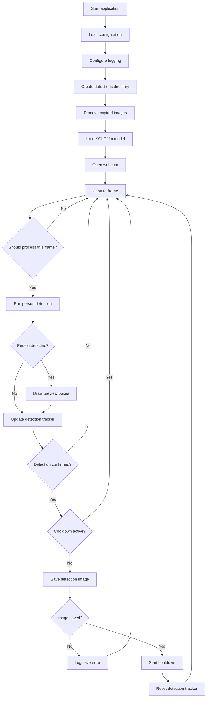
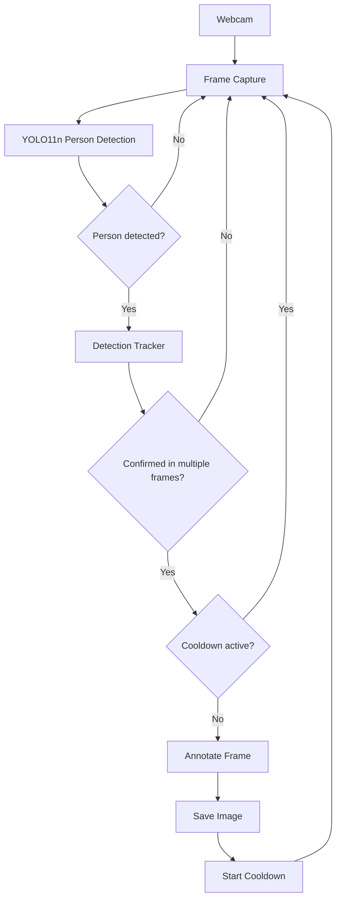

Você é um engenheiro de software sênior especializado em Python, visão computacional e arquitetura limpa.

Sua tarefa é desenvolver uma aplicação local de monitoramento por webcam em tempo real usando YOLO, capaz de detectar pessoas e salvar uma imagem do momento da detecção dentro de uma pasta do projeto.

## Contexto do projeto

A aplicação será executada localmente em um MacBook Air M3 com:

* 8 GB de memória unificada
* 256 GB de SSD
* macOS
* GPU Apple Silicon com suporte a MPS

A aplicação deve ser leve, eficiente e evitar consumo excessivo de memória, CPU, GPU e armazenamento.

## Objetivo principal

A aplicação deve:

1. Capturar imagens em tempo real pela webcam.
2. Utilizar o modelo YOLO11n para detectar exclusivamente pessoas.
3. Confirmar a presença de uma pessoa em múltiplos frames antes de registrar uma detecção.
4. Salvar uma imagem do momento da detecção.
5. Desenhar uma bounding box ao redor da pessoa detectada.
6. Exibir na imagem a confiança da detecção.
7. Adicionar data e horário ao print.
8. Salvar a imagem dentro da pasta `detections`, localizada na raiz do projeto.
9. Aplicar um intervalo de cooldown para impedir que várias imagens sejam salvas enquanto a mesma pessoa continuar diante da webcam.
10. Remover automaticamente imagens antigas com base em um período de retenção configurável.

Nesta primeira versão, não deve existir qualquer integração com WhatsApp, APIs externas, requisições HTTP, filas de envio ou serviços de mensageria.

## Tecnologias obrigatórias

Utilize:

* Python 3.11 ou superior
* Ultralytics
* YOLO11n
* OpenCV
* PyTorch com MPS, quando disponível
* python-dotenv para variáveis de ambiente
* Pytest para testes automatizados

## Configuração recomendada do modelo

Utilize inicialmente:

* Modelo: `yolo11n.pt`
* Classe detectada: `person`
* ID da classe COCO: `0`
* Dispositivo: `mps`, quando disponível
* Fallback: `cpu`
* Resolução de inferência: `480`
* Confiança mínima: `0.65`
* Processar apenas um frame a cada dois frames capturados
* `verbose=False`

A seleção do dispositivo deve ser automática:

```python
device = "mps" if torch.backends.mps.is_available() else "cpu"
```

Caso o processamento com MPS apresente incompatibilidade em alguma operação, implemente um fallback seguro para CPU e registre essa mudança nos logs.

## Regras para confirmação da detecção

Não salve uma imagem ao detectar uma pessoa em apenas um frame.

Implemente uma janela deslizante com as seguintes regras iniciais:

* Armazenar o resultado dos últimos 5 frames processados.
* Considerar a presença confirmada quando pelo menos 3 dos últimos 5 frames contiverem uma pessoa.
* Tornar esses valores configuráveis por variáveis de ambiente.

Exemplo:

```env
DETECTION_WINDOW_SIZE=5
MINIMUM_POSITIVE_FRAMES=3
```

O componente responsável por essa confirmação não deve depender diretamente do OpenCV ou do YOLO.

## Cooldown

Implemente um cooldown configurável.

Depois que uma imagem for salva com sucesso, nenhuma nova imagem deve ser salva durante o período definido.

Valor inicial:

```env
CAPTURE_COOLDOWN_SECONDS=60
```

A captura da webcam e a execução das detecções devem continuar normalmente durante o cooldown.

Durante esse período, a interface deve informar que o cooldown está ativo.

O cooldown somente deve começar depois que a imagem tiver sido salva com sucesso.

## Imagem da detecção

Quando a presença de uma pessoa for confirmada:

1. Faça uma cópia do frame atual.
2. Desenhe a bounding box de todas as pessoas detectadas no frame.
3. Exiba a confiança de cada detecção.
4. Adicione data e horário.
5. Adicione o texto `Person detected`.
6. Salve a imagem em formato JPEG.
7. Use a pasta configurada em `IMAGE_DIRECTORY`.
8. Use um nome de arquivo único e descritivo.

Exemplo:

```text
detections/detection_20260716_153000_123456.jpg
```

Inclua microssegundos ou outro identificador para evitar colisão entre nomes.

A função de salvamento deve retornar o caminho completo do arquivo criado.

Caso o salvamento falhe:

* Registre o erro.
* Não inicie o cooldown.
* Não encerre a aplicação.
* Continue monitorando a webcam.

## Retenção das imagens

Implemente a remoção automática de imagens antigas.

Utilize inicialmente:

```env
IMAGE_RETENTION_HOURS=24
```

A limpeza deve:

* Considerar apenas arquivos de imagem dentro da pasta configurada.
* Remover arquivos mais antigos que o período definido.
* Não interromper a aplicação caso algum arquivo não possa ser removido.
* Registrar os arquivos removidos nos logs.
* Ignorar arquivos desconhecidos ou subdiretórios.

Execute a limpeza:

* Ao iniciar a aplicação.
* Periodicamente durante a execução.

Utilize uma variável configurável:

```env
IMAGE_CLEANUP_INTERVAL_MINUTES=30
```

## Interface local

Exiba uma janela do OpenCV contendo:

* Vídeo em tempo real.
* Bounding boxes das pessoas detectadas.
* Confiança de cada detecção.
* FPS aproximado.
* Dispositivo utilizado: `MPS` ou `CPU`.
* Quantidade de pessoas detectadas no frame.
* Status atual da aplicação.

Status possíveis:

* `Monitoring`
* `Person detected`
* `Detection confirmed`
* `Image saved`
* `Cooldown`
* `Camera error`
* `Inference error`
* `Save error`

Permita encerrar a aplicação pressionando a tecla `q`.

Garanta a liberação correta da webcam e o fechamento das janelas em todos os cenários, incluindo:

* Encerramento pela tecla `q`
* Interrupção com `Ctrl+C`
* Erro inesperado
* Falha na webcam

Utilize `try`, `except` e `finally` para garantir a liberação dos recursos.

## Estrutura de pastas

Crie o projeto seguindo aproximadamente esta estrutura:

```text
person-detection-monitor/
├── app/
│   ├── __init__.py
│   ├── main.py
│   ├── config.py
│   ├── camera.py
│   ├── detector.py
│   ├── models.py
│   ├── detection_tracker.py
│   ├── capture_controller.py
│   ├── image_manager.py
│   └── logging_config.py
├── detections/
│   └── .gitkeep
├── tests/
│   ├── test_detection_tracker.py
│   ├── test_capture_controller.py
│   ├── test_image_manager.py
│   └── test_config.py
├── .env.example
├── .gitignore
├── requirements.txt
├── README.md
└── run.py
```

## Responsabilidade dos arquivos

### `config.py`

Deve:

* Ler as variáveis do `.env`.
* Validar configurações.
* Converter valores para os tipos corretos.
* Definir valores padrão seguros.
* Centralizar toda a configuração da aplicação.
* Gerar mensagens claras para configurações inválidas.

### `camera.py`

Deve:

* Inicializar a webcam.
* Configurar largura e altura.
* Capturar frames.
* Validar se a câmera foi aberta.
* Liberar corretamente os recursos.
* Encapsular a interação com `cv2.VideoCapture`.

### `detector.py`

Deve:

* Carregar o YOLO11n apenas uma vez.
* Selecionar automaticamente MPS ou CPU.
* Executar inferências.
* Filtrar somente a classe `person`.
* Aplicar o limite mínimo de confiança.
* Retornar objetos estruturados de detecção.
* Não salvar imagens.
* Não controlar cooldown.
* Não acessar diretamente variáveis de ambiente.

### `models.py`

Utilize `dataclasses` para representar informações importantes.

Exemplo:

```python
from dataclasses import dataclass


@dataclass(frozen=True)
class Detection:
    x1: int
    y1: int
    x2: int
    y2: int
    confidence: float
    class_id: int
    class_name: str
```

Caso seja útil, crie também:

```python
from dataclasses import dataclass
from datetime import datetime
from pathlib import Path


@dataclass(frozen=True)
class DetectionCapture:
    image_path: Path
    detected_at: datetime
    highest_confidence: float
    person_count: int
```

### `detection_tracker.py`

Deve:

* Manter uma janela deslizante com os últimos resultados.
* Registrar se cada frame processado contém ou não uma pessoa.
* Confirmar a detecção quando atingir a quantidade mínima configurada.
* Permitir reset do histórico.
* Não depender diretamente de OpenCV, NumPy ou YOLO.
* Ser facilmente testável.

### `capture_controller.py`

Deve:

* Decidir quando uma imagem pode ser salva.
* Controlar o cooldown.
* Impedir capturas duplicadas.
* Iniciar o cooldown somente depois do salvamento bem-sucedido.
* Permitir a injeção de uma função de relógio.
* Não executar inferência.
* Não desenhar bounding boxes.
* Não salvar diretamente arquivos.

A função de relógio deve ser injetável para permitir testes sem utilizar `sleep`.

### `image_manager.py`

Deve:

* Criar a pasta de imagens caso ela não exista.
* Receber um frame e uma lista de detecções.
* Criar uma cópia do frame antes de modificá-lo.
* Desenhar bounding boxes.
* Escrever confiança e informações da detecção.
* Adicionar data e horário.
* Salvar a imagem.
* Retornar o caminho do arquivo salvo.
* Remover imagens antigas.
* Tratar erros de leitura, escrita e remoção.
* Não depender diretamente do modelo YOLO.

### `logging_config.py`

Deve:

* Centralizar a configuração dos logs.
* Definir formato consistente.
* Incluir data, horário, nível e nome do módulo.
* Permitir nível configurável por variável de ambiente.

## Fluxo principal

O fluxo da aplicação deve ser:



## Loop principal

O loop principal deve:

1. Capturar um frame.
2. Ignorar frames conforme `PROCESS_EVERY_N_FRAMES`.
3. Executar a inferência.
4. Filtrar somente pessoas.
5. Atualizar o histórico de detecção.
6. Atualizar a interface.
7. Confirmar a presença em múltiplos frames.
8. Verificar se o cooldown está ativo.
9. Salvar a imagem quando permitido.
10. Resetar o histórico depois de uma captura bem-sucedida.
11. Executar periodicamente a limpeza das imagens antigas.
12. Verificar se a tecla `q` foi pressionada.

Evite concentrar toda essa lógica diretamente em `main.py`. Utilize os componentes especializados.

## Variáveis de ambiente

Crie um `.env.example` completo:

```env
CAMERA_INDEX=0
CAMERA_WIDTH=1280
CAMERA_HEIGHT=720

MODEL_PATH=yolo11n.pt
MODEL_IMAGE_SIZE=480
CONFIDENCE_THRESHOLD=0.65
PROCESS_EVERY_N_FRAMES=2

DETECTION_WINDOW_SIZE=5
MINIMUM_POSITIVE_FRAMES=3

CAPTURE_COOLDOWN_SECONDS=60

IMAGE_DIRECTORY=detections
IMAGE_FORMAT=jpg
IMAGE_JPEG_QUALITY=90
IMAGE_RETENTION_HOURS=24
IMAGE_CLEANUP_INTERVAL_MINUTES=30

LOG_LEVEL=INFO
```

Valide as seguintes regras:

* `CAMERA_INDEX` deve ser maior ou igual a zero.
* `MODEL_IMAGE_SIZE` deve ser maior que zero.
* `CONFIDENCE_THRESHOLD` deve estar entre `0` e `1`.
* `PROCESS_EVERY_N_FRAMES` deve ser maior ou igual a `1`.
* `DETECTION_WINDOW_SIZE` deve ser maior que zero.
* `MINIMUM_POSITIVE_FRAMES` deve ser maior que zero.
* `MINIMUM_POSITIVE_FRAMES` não pode ser maior que `DETECTION_WINDOW_SIZE`.
* `CAPTURE_COOLDOWN_SECONDS` não pode ser negativo.
* `IMAGE_JPEG_QUALITY` deve estar entre `1` e `100`.
* Os períodos de retenção e limpeza devem ser positivos.

## Dependências

Crie um `requirements.txt` com versões compatíveis com macOS e Apple Silicon.

Inclua somente as dependências necessárias:

```text
ultralytics
opencv-python
torch
torchvision
python-dotenv
pytest
```

Não adicione:

* Requests
* HTTPX
* Bibliotecas de WhatsApp
* Redis
* Celery
* Bibliotecas de filas
* Clientes HTTP
* Dependências de banco de dados

## Desempenho

A aplicação deve ser otimizada para o MacBook Air M3 com 8 GB.

Implemente:

* YOLO11n.
* Inferência com imagem de tamanho `480`.
* Processamento de um frame a cada dois.
* Filtro exclusivo para a classe `person`.
* Modelo carregado somente uma vez.
* Uso de MPS quando disponível.
* Fallback para CPU.
* Cópia do frame apenas quando necessário.
* Ausência de armazenamento de frames em memória.
* Liberação de referências desnecessárias.
* Logs sem excesso dentro do loop principal.

Evite registrar uma mensagem de log para todos os frames processados.

## Qualidade do código

O código deve seguir:

* Type hints.
* Funções pequenas.
* Responsabilidade única.
* Separação de responsabilidades.
* Injeção de dependências quando útil.
* Tratamento explícito de exceções.
* Código compatível com macOS.
* Nomes de classes, métodos e variáveis em inglês.
* Logs no lugar de `print`.
* Comentários somente onde agregarem contexto.
* Sem código morto.
* Sem pseudocódigo.
* Sem credenciais ou caminhos absolutos hardcoded.

## Logs

Utilize o módulo padrão `logging`.

Inclua logs para:

* Aplicação iniciada.
* Configurações carregadas.
* Modelo carregado.
* Dispositivo selecionado.
* Fallback de MPS para CPU.
* Webcam inicializada.
* Pessoa detectada.
* Detecção confirmada.
* Imagem salva.
* Caminho da imagem salva.
* Cooldown iniciado.
* Imagem antiga removida.
* Erro da webcam.
* Erro de inferência.
* Erro ao salvar imagem.
* Erro ao remover imagem.
* Aplicação encerrada.

Evite logs repetitivos a cada frame.

## Testes automatizados

Crie testes unitários para os componentes que não dependem da webcam ou do modelo real.

### `DetectionTracker`

Teste:

* Não confirmar sem resultados suficientes.
* Não confirmar com menos detecções positivas que o limite.
* Confirmar com 3 de 5 frames positivos.
* Remover os valores mais antigos da janela.
* Resetar corretamente o histórico.
* Aceitar janelas e limites configuráveis.
* Rejeitar configurações inválidas.

### `CaptureController`

Teste:

* Permitir a primeira captura.
* Bloquear durante o cooldown.
* Permitir novamente depois do cooldown.
* Não iniciar cooldown antes do salvamento.
* Não iniciar cooldown quando o salvamento falhar.
* Iniciar cooldown depois do salvamento bem-sucedido.
* Resetar corretamente seu estado.

Utilize uma função de relógio falsa e não use `sleep`.

### `ImageManager`

Teste:

* Criar a pasta quando ela não existir.
* Gerar nomes únicos.
* Salvar uma imagem válida.
* Desenhar anotações sem alterar o frame original.
* Retornar o caminho correto.
* Remover imagens expiradas.
* Manter imagens dentro do período de retenção.
* Ignorar arquivos que não sejam imagens.
* Tratar falhas do `cv2.imwrite`.

Utilize diretórios temporários do Pytest.

### Configuração

Teste:

* Carregamento dos valores padrão.
* Conversão de números.
* Conversão de valores inválidos.
* Validação da confiança.
* Validação da janela de detecção.
* Validação da qualidade JPEG.
* Mensagens claras de erro.

Os testes não devem:

* Abrir a webcam.
* Baixar o modelo YOLO.
* Executar inferências reais.
* Depender de internet.
* Escrever na pasta real `detections`.

## `.gitignore`

Crie um `.gitignore` contendo pelo menos:

```gitignore
.venv/
__pycache__/
*.py[cod]
.pytest_cache/
.env
.DS_Store

detections/*
!detections/.gitkeep

*.pt
```

O arquivo do modelo não deve ser versionado.

## README

Crie um `README.md` profissional em inglês contendo:

1. Project overview.
2. Application purpose.
3. Architecture.
4. Application flow.
5. Requirements.
6. Installation on macOS.
7. Virtual environment setup.
8. Dependency installation.
9. Environment configuration.
10. Running the application.
11. Running the tests.
12. How person detection works.
13. Why multiple-frame confirmation is used.
14. How the cooldown works.
15. How images are generated and stored.
16. How image retention works.
17. Performance considerations for a MacBook Air M3 with 8 GB.
18. Privacy considerations.
19. Known limitations.
20. Future improvements.

Inclua no README um diagrama Mermaid:



## Privacidade e segurança

Inclua no README observações sobre:

* Consentimento das pessoas filmadas.
* Uso somente em ambientes autorizados.
* Proteção da pasta de imagens.
* Retenção limitada dos arquivos.
* Possibilidade de falsos positivos.
* Possibilidade de falsos negativos.
* Não utilizar a aplicação como único mecanismo de segurança.
* Não expor publicamente a pasta `detections`.
* Não versionar as imagens capturadas.
* Respeitar as leis locais relacionadas à gravação e monitoramento.

## Critérios de aceite

A implementação será considerada concluída quando:

1. A webcam abrir corretamente.
2. O YOLO11n detectar somente pessoas.
3. A aplicação utilizar MPS quando disponível.
4. Houver fallback para CPU.
5. A detecção precisar ser confirmada em múltiplos frames.
6. Uma imagem com bounding box for salva.
7. A confiança aparecer na imagem.
8. A data e o horário aparecerem na imagem.
9. A imagem for armazenada na pasta `detections`.
10. O cooldown impedir capturas repetitivas.
11. O histórico for resetado após uma captura bem-sucedida.
12. Imagens antigas forem removidas automaticamente.
13. Falhas de salvamento não encerrarem a aplicação.
14. Todas as configurações estiverem no `.env`.
15. Os testes unitários passarem.
16. O README explicar instalação, arquitetura e execução.
17. A aplicação liberar corretamente a câmera e as janelas.
18. Não existir qualquer integração HTTP ou com WhatsApp.

## Fora do escopo desta versão

Não implemente:

* Envio de mensagens para WhatsApp.
* Requisições HTTP.
* Upload de imagens.
* Integração com APIs externas.
* Banco de dados.
* Autenticação.
* Interface web.
* Armazenamento em nuvem.
* Reconhecimento facial.
* Identificação da pessoa.
* Gravação contínua de vídeo.
* Streaming remoto.
* Notificações por e-mail, SMS ou push.
* Fila assíncrona.
* Redis.
* Docker, a menos que já exista no repositório e seja necessário preservá-lo.

A aplicação deve somente detectar pessoas, confirmar a detecção e salvar localmente uma imagem anotada.

## Forma de trabalho

Antes de implementar:

1. Analise a estrutura atual do repositório.
2. Apresente brevemente a arquitetura proposta.
3. Liste os arquivos que serão criados ou modificados.
4. Identifique decisões técnicas importantes.
5. Preserve arquivos existentes que não precisem ser alterados.

Depois:

1. Implemente o projeto arquivo por arquivo.
2. Não gere apenas pseudocódigo.
3. Escreva código funcional e executável.
4. Não concentre toda a aplicação em um único arquivo.
5. Não adicione funcionalidades fora do escopo.
6. Não adicione integração com WhatsApp ou APIs externas.

Ao terminar:

1. Revise imports e dependências.
2. Verifique possíveis erros de tipagem.
3. Verifique se todas as variáveis de ambiente estão documentadas.
4. Verifique se os testes não dependem de webcam, modelo real ou internet.
5. Execute os testes, caso o ambiente permita.
6. Informe claramente qualquer etapa que não tenha sido possível validar.

Mostre os comandos exatos para instalar e executar:

```bash
python3 -m venv .venv
source .venv/bin/activate
pip install -r requirements.txt
cp .env.example .env
python run.py
```

Para executar os testes:

```bash
pytest
```

Comece analisando a estrutura atual do repositório antes de criar ou alterar arquivos.
